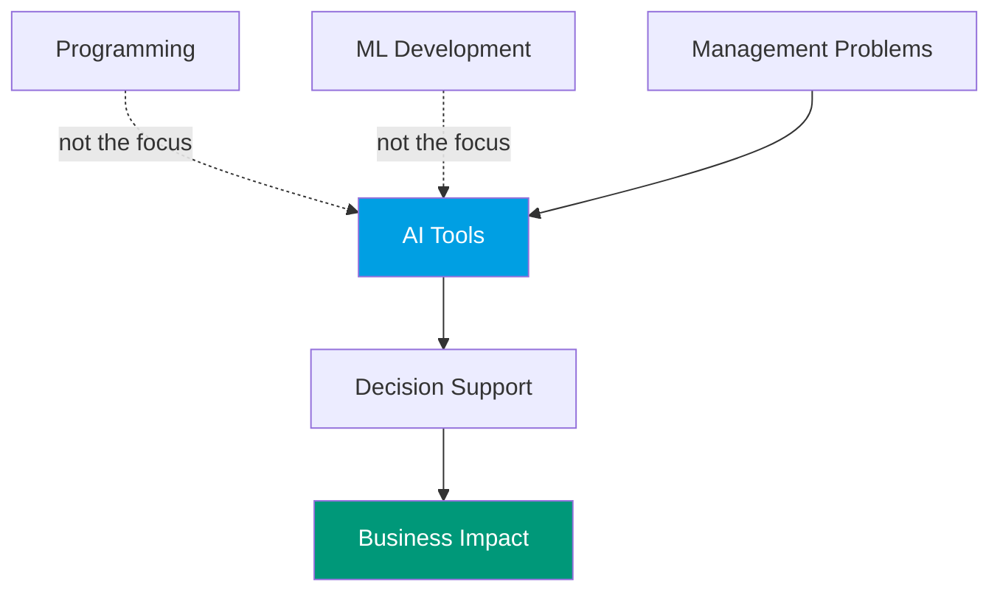
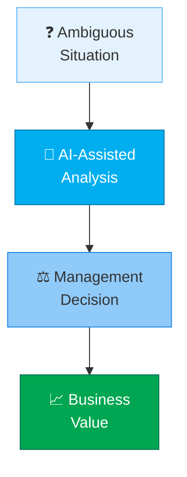
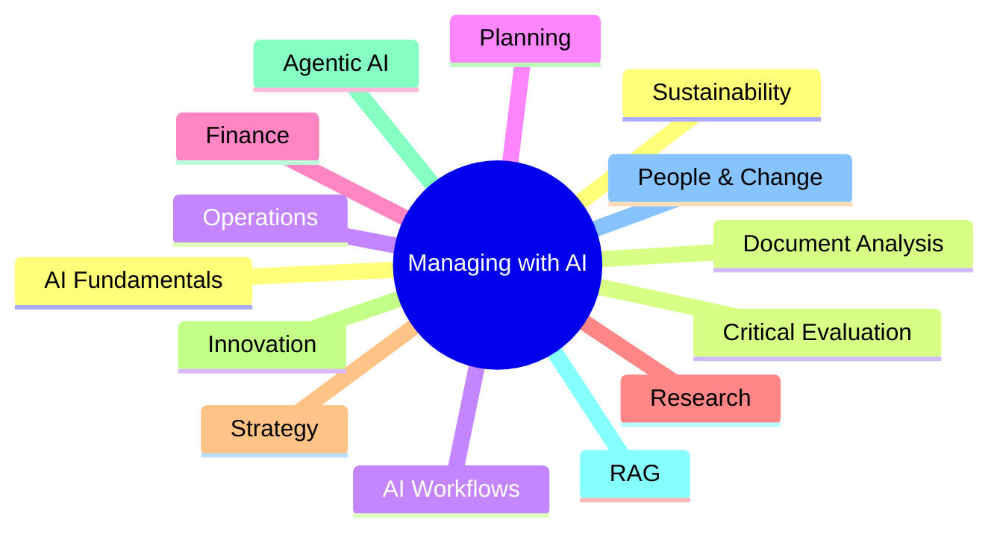

---
# try also 'default' to start simple
theme: seriph
# random image from a curated Unsplash collection by Anthony
# like them? see https://unsplash.com/collections/94734566/slidev
background: ./images/Designer.png  # https://cover.sli.dev
# some information about your slides (markdown enabled)
title: Managing with Artificial Intelligence
info: |
  # Master in Organizational Engineering
  Academic Year 2026-27 (https://apiivm01.etsii.upm.es/~jordieres/T01/)
# apply UnoCSS classes to the current slide
class: text-center
# https://sli.dev/features/drawing
drawings:
  persist: false
# slide transition: https://sli.dev/guide/animations.html#slide-transitions
transition: slide-left
# enable Comark Syntax: https://comark.dev/syntax/markdown
comark: true
# duration of the presentation
duration: 35min

---

# Presentation of the Course Management with AI

## Guidelines

  Press Space for next page <carbon:arrow-right />

  <button @click="$slidev.nav.openInEditor()" title="Open in Editor" class="slidev-icon-btn">
    <carbon:edit />
  </button>
  <a href="https://github.com/jordieres/MwAI-slidev" target="_blank" class="slidev-icon-btn">
    <carbon:logo-github />
  </a>

<!--
The last comment block of each slide will be treated as slide notes. It will be visible and editable in Presenter Mode along with the slide. [Read more in the docs](https://sli.dev/guide/syntax.html#notes)
-->

---
title: Managing with Artificial Intelligence
layout: default
transition: fade-out
background: ./images/Designer.png
backgroundSize: cover
---

### Master in Organizational Engineering

Artificial Intelligence **is transforming the way organizations make decisions, solve problems and create value**.

The course “Management with Artificial Intelligence” aims to introduce students to the *applied, critical and responsible* use of artificial intelligence tools, with particular emphasis on generative AI, as a support for decision-making and problem solving in different management domains. 

The course *is not conceived as a purely technical course on programming or algorithmic modelling*, but as a learning environment in which students learn to formulate management problems, structure information, design AI-assisted work assignments, critically assess outputs and communicate conclusions that are useful for managerial action.

**Welcome to the course.**

<!--
The last comment block of each slide will be treated as slide notes. It will be visible and editable in Presenter Mode along with the slide. [Read more in the Course Guide](https://www.upm.es/comun_gauss/publico/guias/2026-27/GA_05BL_53002103_EN_2026-27.pdf)
-->

---
title: What is this course about?
layout: two-cols
background: ./images/Designer.png
backgroundSize: cover
---

::left::

<v-clicks>

- Not a programming course
- Not a machine learning development course
- A course about using AI for management

</v-clicks>

<v-clicks>

### You will learn to:

</v-clicks>

<v-clicks>

- Formulate management problems
- Interact effectively with AI systems
- Validate outputs
- Identify risks and limitations
- Communicate actionable recommendations

</v-clicks>

Source: GA_05BL_53002103_EN_1.pdf.

::right::

<v-clicks>

</v-clicks>

<!--
Pay attention to the course focus all the time
-->

---
title: Why AI for Management?
layout: two-cols
background: ./images/Designer.png
backgroundSize: cover
---

::left:: 

## AI is increasingly used in:

- Operations
- Finance
- Research
- Innovation
- Strategy
- Human Resources
- Sustainability

::right::

## Key Idea

> AI expands analytical capabilities.

But:

> Human judgment remains responsible for final decisions.

This means YOU must be aware of what you have asked, how you did it and the trustability of the answer.

Source: GA_05BL_53002103_EN_1.pdf.

---
title: Course Goal
layout: two-cols
background: ./images/Designer.png
backgroundSize: cover
---

::left:: 

### By the end of the course you should be able to:

<v-clicks>

✅ Identify AI opportunities

✅ Transform ambiguous situations into structured problems

✅ Design AI-assisted workflows

✅ Critically evaluate outputs

✅ Build useful management deliverables

✅ Communicate professional recommendations

</v-clicks>

::right::

<v-clicks>

</v-clicks>

---
title: AI is a Cognitive Assistant
layout: default
background: ./images/Designer.png
backgroundSize: cover
---

### What AI SHOULD do

  ✅ Support analysis

  ✅ Generate alternatives

  ✅ Accelerate learning

  ✅ Improve productivity

 

### What AI SHOULD NOT do

  ❌ Replace professional responsibility

  ❌ Substitute critical thinking

  ❌ Be trusted without validation

Source: GA_05BL_53002103_EN_1.pdf.

---
title: Course Topics
layout: default
class: text-center
background: ./images/Designer.png
backgroundSize: cover
---

---
title: Assessment Criteria
layout: two-cols
background: ./images/Designer.png
backgroundSize: cover
---

::left::

## Progressive Assessment

It is group driven with individual tunning.

<v-clicks>

✅ Weekly portfolio of group assignments: 60% (Group).

✅ Final integrative group project: 17.5% (Group).

✅ Gamification: 15% (Individual).

✅ Individual class participation: 7.5% (Individual).

</v-clicks>

::right::

## Final Assessment

> **Theoretical Exam** (can be ran in Oral mode).

<v-clicks>

✅ Mastery of fundamental concepts (20%).

✅ Application to management problems (15%).

✅ Analysis and critical evaluation of results (15%).

✅ Responsible use, ethics, and governance (10%).

</v-clicks>

> **Practical Test.**

<v-clicks>

✅ Definition and contextualization of the problem (6%).

✅ Design of the approach and workflow (8%).

✅ Effective use of AI tools (8%).

✅ Validation, comparison, and critical analysis (8%).

✅ Quality of the result and usefulness for management (5%).

✅ Communication and presentation of the deliverable (3%).

✅ Traceability and declaration of AI use (2%).

</v-clicks>

---
title: Everything clear?
layout: default
transition: fade-out
background: ./images/Designer.png
backgroundSize: cover
---

# Feel free to ask any question you may have ... 

<v-clicks>

NOW!

Moodle: 🌐 https://moodle.upm.es/titulaciones/oficiales2627/course/view.php?id=26069

Email: [✉ Contact](mailto:j.ordieres@upm.es)

</v-clicks>

<!--
Time for handling questions
-->
---
title: Topics of activities
layout: default
transition: fade-out
background: ./images/Designer.png
backgroundSize: cover
---

# Rubrics

The competition should not reward simply obtaining the highest headline
number. It should reward the best professionally defensible solution. 
Each challenge should include three evaluation layers.

### Common rubric

| **Criterion** | **Weight** |
|---|---:|
| Problem formulation and managerial relevance | 15% |
| Definition and justification of success criteria | 10% |
| Prompting and AI-interaction design | 15% |
| Data and evidence preparation | 15% |
| Analytical, scripting or workflow quality | 15% |
| Validation, testing and critical assessment | 15% |
| Feasibility and usefulness for decision-making | 10% |
| Traceability, responsible AI use and communication | 5% |

### Challenge performance

| **Performance dimensions** |
|---|
| Schedule performance |
| Return under simulated scenarios |
| Strategic consistency |
| Workflow reliability |
| Robustness under hidden cases |

### Recognition awards

| **Award categories** |
|---|
| Best management insight |
| Best validated solution |
| Most innovative use of AI |
| Best risk analysis |
| Best executive communication |

---
title: Challenges
layout: default
transition: fade-out
background: ./images/Designer.png
backgroundSize: cover
---

### Challenge 1: Should Orion Manufacturing Adopt an AI-Enabled Operations Platform?

#### Management context

Orion Manufacturing is a fictional medium-sized industrial company with approximately 650 employees, three production sites and uneven levels of digital maturity. Senior management is considering the adoption of an AI-enabled platform covering:

• Predictive maintenance

• Production analytics

• Document & knowledge assistance

• Quality-event analysis

• Management reporting

The investment is supported by the Chief Digital Officer but questioned by operations managers, employee representatives and the finance department. The group acts as an external advisory team and must recommend:

• whether the company should adopt the technology

• where adoption should begin

• which implementation model should be selected

• under which organisational and governance conditions.

  <h4>Data Resources</h4>
  
Datasets, templates, and examples to be used during the Challenge.
  <a href="/~jordieres/data/Challenge_1_Technology_Adoption_Student_Package.zip">
     📦 Download Data Package
  </a>

---
title: Other Challenges
layout: default
transition: fade-out
background: ./images/Designer.png
backgroundSize: cover
---

### Challenge 2: Planning, Scheduling and Resource Allocation. Recover the Weekly Production Plan

#### Management context

A fictional manufacturer must schedule a portfolio of production orders across several resources over a five-day horizon. A key machine becomes unavailable, two urgent orders arrive, labour availability is constrained and some tasks require specialised operators.
The group must produce a feasible and defensible recovery schedule.

### Challenge 3: Capital Investment Portfolio Selection. Which Projects Should the Company Fund?

#### Management context

A diversified company has a fixed three-year investment budget and must choose among competing projects. Some projects are mandatory, some are mutually exclusive, and others create synergies or require common infrastructure.
The challenge is deliberately more complex than ranking projects by net present value.

---
title: Other Challenges
layout: default
transition: fade-out
background: ./images/Designer.png
backgroundSize: cover
---

### Challenge 4: Digital Health Strategy and Business Model Innovation. Design a Viable Digital Health Service for Chronic-Care Management

#### Management context

A regional healthcare provider wants to improve the management of patients with a chronic condition through a digital service. The service may combine:

• patient-reported data;

• remote monitoring;

• professional dashboards;

• alerts;

• education;

• appointment prioritisation;

• care coordination.

The objective is not to develop a clinical diagnostic model. It is to design a credible digital-health strategy, operating model and business case.
A suitable fictional use case would be remote monitoring for patients with multiple sclerosis, diabetes, chronic obstructive pulmonary disease or heart failure. Multiple sclerosis is particularly suitable because it creates clear needs concerning longitudinal monitoring, care coordination, patient-generated data and variable disease progression.

---
title: Other Challenges
layout: default
transition: fade-out
background: ./images/Designer.png
backgroundSize: cover
---

### Challenge 5: Integrated AI-Enabled Management Workflow. AI-Assisted Project Intake, Evaluation and Portfolio Governance Workflow

This workflow should provide a meaningful culmination because it integrates document analysis, prompting, data preparation, scripting, tool use, validation, state management and human review.

#### Management context

Transform a heterogeneous proposal into a structured, validated and auditable Project Evaluation Dossier.
A large organisation receives many internal proposals for:

• digital-transformation projects;

• operational improvements;

• sustainability initiatives;

• research and innovation activities;

• capital investment.

Currently, proposals are submitted in different formats, assessed inconsistently and repeatedly returned because information is missing. Senior management wants an AI-assisted workflow that improves consistency and speed while preserving human decision authority.
The system must not autonomously approve projects. It must prepare an evidence-based recommendation for a review committee.

