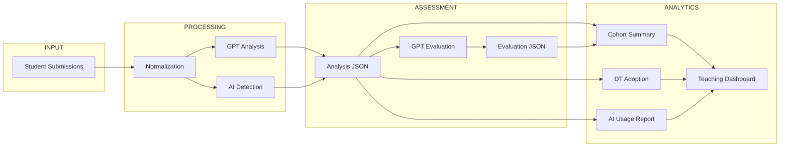

---
# try also 'default' to start simple
theme: seriph
# random image from a curated Unsplash collection by Anthony
# like them? see https://unsplash.com/collections/94734566/slidev
background: ./images/Designer.png  # https://cover.sli.dev
# some information about your slides (markdown enabled)
title: Managing with Artificial Intelligence
info: |
  # Master in Organizational Engineering
  Academic Year 2026-27 (https://apiivm01.etsii.upm.es/~jordieres/T01b/)
# apply UnoCSS classes to the current slide
class: text-center
# https://sli.dev/features/drawing
drawings:
  persist: false
# slide transition: https://sli.dev/guide/animations.html#slide-transitions
transition: slide-left
# enable Comark Syntax: https://comark.dev/syntax/markdown
comark: true
# duration of the presentation
duration: 35min

---

# T01 Feedback from Last Individual Class Assigment

## Guidelines

  Press Space for next page <carbon:arrow-right />

  <button @click="$slidev.nav.openInEditor()" title="Open in Editor" class="slidev-icon-btn">
    <carbon:edit />
  </button>
  <a href="https://github.com/MwAI-UPM/2026-ind_assign_01/" target="_blank" class="slidev-icon-btn">
    <carbon:logo-github />
  </a>

<!--
The last comment block of each slide will be treated as slide notes. It will be visible and editable in Presenter Mode along with the slide. [Read more in the docs](https://sli.dev/guide/syntax.html#notes)
-->

---
title: Did you remember the last individual assigment?
layout: two-cols
background: ./images/Designer.png
backgroundSize: cover
---

::left::

### Deliverable

56 of you uploaded information into moodle drop-off area.
Thanks

Although the instrucitons were to report one zip file having every individual task and it was expected one zip with five documents inside (Task_1.{pdf,docx}, ...) the reality, as expected from humans, was very much different

So the challenge is to elaborate a way to analyze and compare aproaches.

::right::

<pre style="font-family: inherit; font-size: inherit; background: transparent; padding: 0; margin: 0;">

Assignment_Class_01/2026-ind_assign_01$ ls -lR ../*_file

'../BEYRIES EMILE_80974_assignsubmission_file':
total 68
drwxrwxr-x 2 jb jb  4096 sep 19 19:27 'steel scheduling doc'
-rwxr-xr-x 1 jb jb 62619 sep 16 11:36 'steel scheduling doc.zip'

'../BEYRIES EMILE_80974_assignsubmission_file/steel scheduling doc':
total 264
-rw-rw-r-- 1 jb jb  8809 sep 19 19:27 index.html
-rw-rw-r-- 1 jb jb 63251 sep 19 19:27 task1_inventory.html
-rw-rw-r-- 1 jb jb 82755 sep 19 19:27 task2_mapping.html
-rw-rw-r-- 1 jb jb 46452 sep 19 19:27 task3_divergence.html
-rw-rw-r-- 1 jb jb 31885 sep 19 19:27 task4_blueprint.html
-rw-rw-r-- 1 jb jb 22250 sep 19 19:27 task5_executive_briefing.html

'../BOZAL APESTEGUIA LOREA_80971_assignsubmission_file':
total 1700
drwxrwxr-x 3 jb jb    4096 sep 19 19:27 'Drop-off of 1st assignment'
-rwxr-xr-x 1 jb jb 1733912 sep 16 11:52 'Drop-off of 1st assignment.zip'

'../BOZAL APESTEGUIA LOREA_80971_assignsubmission_file/Drop-off of 1st assignment':
total 4
drwxrwxr-x 2 jb jb 4096 sep 19 19:27 'Drop-off of 1st assignment'

'../BOZAL APESTEGUIA LOREA_80971_assignsubmission_file/Drop-off of 1st assignment/Drop-off of 1st assignment':
total 1960
-rw-rw-r-- 1 jb jb  107111 sep 19 19:27 'Informe 3_ Synthesis Divergence .pdf'
-rw-rw-r-- 1 jb jb  285158 sep 19 19:27 'Tarea 1_ Inventory & Initial Scan.pdf'
-rw-rw-r-- 1 jb jb 1605783 sep 19 19:27 'Tarea 2 .png'

'../BUYSSE AMELIE_80940_assignsubmission_file':
total 2112
drwxrwxr-x 3 jb jb    4096 sep 19 19:27 'Managing with AI'
-rwxr-xr-x 1 jb jb 2155331 sep 16 11:58 'Managing with AI.zip'

'../BUYSSE AMELIE_80940_assignsubmission_file/Managing with AI':
total 156
drwxrwxr-x 2 jb jb   4096 sep 19 19:27 images
-rw-rw-r-- 1 jb jb 154480 sep 19 19:27 ManagingwithAI.html

'../BUYSSE AMELIE_80940_assignsubmission_file/Managing with AI/images':
total 2168
-rw-rw-r-- 1 jb jb 217438 sep 19 19:27 image1.png
-rw-rw-r-- 1 jb jb 775392 sep 19 19:27 image2.png
-rw-rw-r-- 1 jb jb 591547 sep 19 19:27 image3.png
-rw-rw-r-- 1 jb jb 625763 sep 19 19:27 image4.png
</pre>

---
title: How to assess within a secured environment?
layout: default
background: ./images/Designer.png
backgroundSize: cover
---

### Assessment Pipeline

The key point is to develop a pipeline able to 'look for' and to extract convenient information from the raw data.

The process is driven by appropriate cli commands:

<pre style="font-family: inherit; font-size: inherit; background: transparent; padding: 0; margin: 0;">

ls src/assessment_pipeline/
ai_detection.py           evaluate_all.py      models.py           <b>__pycache__</b>
ai_usage_report.py        evaluate_one.py      moodle.py           reporting.py
analyze_all.py            extractor.py         normalizer.py       task_detector.py
analyze_one.py            gpt_oss_analysis.py  parser_registry.py  task_splitter.py
cohort_summary.py         gpt_oss_client.py    <b>parsers</b>             <b>utils</b>
content_task_detector.py  __init__.py          process_all.py
dt_adoption.py            llm_pipeline.py      prompts.py
</pre>

---
title: Have a look at the GitHub if interested!
layout: two-cols
background: ./images/Designer.png
backgroundSize: cover
---

::left::

### Wrong approaches

If you ask Gemini, ChatGPT or Claude without perimeter protection for RAG documents, you are facing direct issues with <b>GDPR reglament</b>.

Indeed, although enabled, since the size is 60MB still will be possible. However diversity is too high and models will fail in doing its its job from scratch:

The main issues encountered when processing the submitted materials were related to heterogeneity, packaging, naming conventions, and the distinction between file structure and actual task content.

* Highly heterogeneous submission formats. Students submitted PDF, DOCX, XLSX, HTML, Markdown, TXT, ZIP and RAR files. Some submissions contained one document per task, while others used a single combined report containing several or all five tasks.

* Nested compressed files. Several submissions included ZIP archives inside the main Moodle export. These had to be recursively unpacked before the real submission structure could be identified. One submission was provided as a RAR archive, whose directory could be inspected but whose contents could not be reliably extracted with the available processing tools. Consequently, some content-based measures for that submission could not be calculated.

::right::

* 
 Inconsistent file naming. Task files were named in many different ways, such as Task 3, Task3 Report, Task n°5, Executive Briefing, Integrative Synthesis, or combinations such as Task 2-3-4-5. Therefore, task identification could not rely exclusively on filenames.

* 
 Multiple tasks embedded in one document. A significant number of students submitted one PDF or Word document containing Tasks 1–5. Counting files alone would therefore incorrectly suggest that these students had submitted only one task. Content inspection was necessary to identify the internal task sections.

* 
 Auxiliary material mixed with assessed tasks. Some submissions contained prompts, README files, methodological notes, figures, CSV datasets, intermediate results, references, or supporting spreadsheets. These needed to be distinguished from the five requested task deliverables.

* 
 Duplicate and operating-system files containing macOS metadata such as __MACOSX, temporary files, or repeated copies of the same document. These were excluded from the effective document count where possible.

---
title: Have a look at the GitHub if interested!
layout: two-cols
background: ./images/Designer.png
backgroundSize: cover
---

::left::

* 
 Task detection is not equivalent to task completion. The processing can identify whether a Task 1–5 section or corresponding file appears to exist, but this does not establish that the task has been correctly or completely performed. A document can contain a heading such as “Task 4” while providing only limited substantive content.

* 
 Content-based and structure-based detection do not always coincide. Some tasks are obvious from filenames but not explicitly labelled inside the document; conversely, some combined reports contain clearly labelled task sections even though the filename provides no indication of them. For this reason, the final detection combined both sources of evidence.

* 
 Character counts require normalization. Raw file size is not a useful proxy for submission length. Text therefore had to be extracted from supported document formats and normalized. Character counts can still be affected by tables, repeated headers, embedded spreadsheet cells, references, or text extraction characteristics, so they should be interpreted as approximate indicators of textual volume rather than exact measures of academic content.

::right::

* 
 The meaning of documents is potentially ambiguous. In the generated table, documents currently means the number of effective files submitted by the student after cleaning and unpacking. It does not mean the number of papers or source documents analysed by the student. If the assignment requires students to analyse, for example, 25 or 30 papers, that number would need to be extracted separately from the report content.

Details have been provided for you to read through at [Deployment of the assessment pipeline](https://mwai-upm.github.io/2026-ind_assign_01/) 

---
title: Have a look at the GitHub (DT adoption)
layout: default
background: ./images/Designer.png
backgroundSize: cover
---

|   student_id | student_name                         | assignment_type    |   tasks_completed | quality   | digital_twin     | dt_evidence                                                                                                                                                                                              |
|-------------:|:-------------------------------------|:-------------------|------------------:|:----------|:-----------------|:---------------------------------------------------------------------------------------------------------------------------------------------------------------------------------------------------------|
|        80928 | MARTINEZ LOPEZ-SERRANO MARIA         | partial_submission |                 1 | low       | DT_not_evaluable | nan                                                                                                                                                                                                      |
|        80929 | GUERRERO GUERRERO FRANCISCO DE BORJA | partial_submission |                 1 | medium    | DT_not_evaluable | nan                                                                                                                                                                                                      |
|        80930 | IRIBARREN ASENJO JUAN                | partial_submission |                 1 | medium    | DT_not_evaluable | nan                                                                                                                                                                                                      |
|        80931 | PARADISO MARIA FERNANDA              | partial_submission |                 1 | low       | DT_not_evaluable | nan                                                                                                                                                                                                      |
|        80932 | MARAVER OSUNA JAVIER                 | partial_submission |                 1 | medium    | DT_not_evaluable | nan                                                                                                                                                                                                      |
|        80933 | VOGEL KACPER                         | full_submission    |                 5 | low       | DT_recommended   | d in the accompanying Integrative Synthesis report. At the executive level, the recommended path is a phased rollout, not a single deployment: Phase 1 — Foundation (0–3 months) Stand up a digital-twin |
|        80934 | KOCER MERT                           | partial_submission |                 2 | medium    | DT_not_evaluable | nan                                                                                                                                                                                                      |
|        80935 | ELBAUM JONATHAN                      | partial_submission |                 1 | low       | DT_not_evaluable | nan                                                                                                                                                                                                      |
|        80936 | MINGO MENENDEZ PABLO                 | full_submission    |                 4 | low       | DT_mentioned     | Digital Twin mentioned                                                                                                                                                                                   |
|        80937 | LE STRAT MAXIME                      | partial_submission |                 1 | medium    | DT_not_evaluable | nan                                                                                                                                                                                                      |
|        80938 | VAN LIEVERLOO BODINE                 | partial_submission |                 2 | medium    | DT_not_evaluable | nan                                                                                                                                                                                                      |
|        80940 | BUYSSE AMELIE                        | partial_submission |                 1 | low       | DT_not_evaluable | nan                                                                                                                                                                                                      |
|        80941 | CAMPOS ORTEGA ALBERTO                | partial_submission |                 2 | medium    | DT_not_evaluable | nan                                                                                                                                                                                                      |
|        80942 | LAVIGNE LUCAS                        | partial_submission |                 1 | low       | DT_not_evaluable | nan                                                                                                                                                                                                      |
|        80943 | GUSTAFSSON TUVA                      | full_submission    |                 4 | medium    | DT_recommended   | ign delivers reliability, adaptability, visibility, and accountability. Action: Implementation Roadmap Phase 1 establishes digital foundations and Digital Twin capabilities. Phase 2 introduces DRL sch |
|        80944 | MENEGOZZO EDOARDO                    | full_submission    |                 4 | low       | DT_mentioned     | Digital Twin mentioned                                                                                                                                                                                   |
|        80945 | LE COUSIN CESAR                      | full_submission    |                 5 | medium    | DT_mentioned     | Digital Twin mentioned                                                                                                                                                                                   |
|        80946 | FELL ELSA                            | full_submission    |                 4 | low       | DT_recommended   | neously optimize efficiency, sustainability, digitalization and resilience. The proposed blueprint integrates the strongest practices identified across all research clusters into a coherent organizati |
|        80947 | ESTRINGANA LOPEZ-REY JORGE           | partial_submission |                 1 | medium    | DT_not_evaluable | nan                                                                                                                                                                                                      |
|        80949 | LANEUS HANNA                         | partial_submission |                 1 | medium    | DT_not_evaluable | nan                                                                                                                                                                                                      |
|        80950 | ESTEVES MAHEL                        | partial_submission |                 1 | low       | DT_not_evaluable | nan                                                                                                                                                                                                      |
|        80951 | SANTOS BARON MARIA                   | full_submission    |                 5 | medium    | DT_not_found     | nan                                                                                                                                                                                                      |
|        80952 | JIMENEZ RODRIGUEZ JORGE              | partial_submission |                 1 | low       | DT_not_evaluable | nan                                                                                                                                                                                                      |
|        80953 | CONTRERAS HERNANDEZ CARLOS           | partial_submission |                 3 | medium    | DT_not_evaluable | nan                                                                                                                                                                                                      |
|        80954 | GURPEGUI ERASO ADRIAN                | partial_submission |                 1 | medium    | DT_not_evaluable | nan                                                                                                                                                                                                      |
|        80956 | SANCHEZ DE LA PRADA PATRICIA         | partial_submission |                 1 | low       | DT_not_evaluable | nan                                                                                                                                                                                                      |
|        80957 | SANCHEZ LINARES ISMAEL               | partial_submission |                 1 | low       | DT_not_evaluable | nan                                                                                                                                                                                                      |
|        80958 | ROUCHY LUCA MAXIM                    | partial_submission |                 1 | low       | DT_not_evaluable | nan                                                                                                                                                                                                      |
|        80959 | GAJDOS TATJANA                       | partial_submission |                 3 | low       | DT_not_evaluable | nan                                                                                                                                                                                                      |
|        80960 | BOUZA FERNANDEZ BRUNO                | full_submission    |                 5 | medium    | DT_recommended   | er operators can question, and a human-in-the-loop override at every step.  The proposed architecture (full detail in the Task 4 report). Delivered well, this gives the plant real-time responsiveness  |
|        80961 | LASHERAS GUELBENZU LUCAS             | partial_submission |                 1 | medium    | DT_not_evaluable | nan                                                                                                                                                                                                      |
|        80962 | HENDRIKS EMMA                        | partial_submission |                 1 | medium    | DT_not_evaluable | nan                                                                                                                                                                                                      |
|        80963 | DEL CARPIO DAVALOS DIEGO ALONSO      | partial_submission |                 1 | low       | DT_not_evaluable | nan                                                                                                                                                                                                      |
|        80964 | GOÑI OTAZU MIKEL                     | partial_submission |                 1 | medium    | DT_not_evaluable | nan                                                                                                                                                                                                      |
|        80965 | RIVIERE ANTHONY                      | partial_submission |                 2 | low       | DT_not_evaluable | nan                                                                                                                                                                                                      |
|        80966 | RODRIGUEZ VALER JOANE                | partial_submission |                 1 | low       | DT_not_evaluable | nan                                                                                                                                                                                                      |
|        80967 | CORREIA CUNHA TIAGO                  | partial_submission |                 1 | low       | DT_not_evaluable | nan                                                                                                                                                                                                      |
|        80968 | HERMES JANO                          | partial_submission |                 1 | low       | DT_not_evaluable | nan                                                                                                                                                                                                      |
|        80969 | HEYSE MARIE                          | partial_submission |                 2 | medium    | DT_not_evaluable | nan                                                                                                                                                                                                      |
|        80970 | SANZ PULIDO CARLOS                   | full_submission    |                 5 | low       | DT_recommended   | t gap explicitly rather than assume the blueprint works at first deployment: 1. Phase 1 — Data backbone (Layer 1 only). Instrument one furnace/line, unify its data feed, and validate the Digital Twin' |
|        80971 | BOZAL APESTEGUIA LOREA               | partial_submission |                 2 | medium    | DT_not_evaluable | nan                                                                                                                                                                                                      |
|        80972 | IBARRA PEREZ JOSE ANTONIO            | partial_submission |                 2 | low       | DT_not_evaluable | nan                                                                                                                                                                                                      |
|        80974 | BEYRIES EMILE                        | full_submission    |                 5 | low       | DT_mentioned     | Digital Twin mentioned                                                                                                                                                                                   |
|        80976 | MELENO FERRER INES                   | partial_submission |                 1 | low       | DT_not_evaluable | nan                                                                                                                                                                                                      |
|        80977 | MENDES FREITAS ANA MARGARIDA         | partial_submission |                 1 | low       | DT_not_evaluable | nan                                                                                                                                                                                                      |
|        80978 | GARCIA ALVAREZ BELEN                 | partial_submission |                 1 | low       | DT_not_evaluable | nan                                                                                                                                                                                                      |
|        80979 | ROJAS DUARTE KAROLD ANDREA           | partial_submission |                 1 | medium    | DT_not_evaluable | nan                                                                                                                                                                                                      |
|        80980 | TARDANICO RICCARDO                   | partial_submission |                 1 | low       | DT_not_evaluable | nan                                                                                                                                                                                                      |
|        80981 | HAAN INGE                            | partial_submission |                 1 | medium    | DT_not_evaluable | nan                                                                                                                                                                                                      |
|        80982 | DESPINASSE HELENE                    | bibliography_only  |                 0 | low       | DT_not_evaluable | nan                                                                                                                                                                                                      |
|        80983 | GALVANO GIACOMO                      | bibliography_only  |                 0 | low       | DT_not_evaluable | nan                                                                                                                                                                                                      |
|        80984 | SUBIAS MORENO ALVARO                 | full_submission    |                 5 | medium    | DT_mentioned     | Digital Twin mentioned                                                                                                                                                                                   |
|        80985 | TROOST MATTHIJS                      | partial_submission |                 2 | medium    | DT_not_evaluable | nan                                                                                                                                                                                                      |
|        80986 | VAN LOMMEL JOOS                      | partial_submission |                 1 | low       | DT_not_evaluable | nan                                                                                                                                                                                                      |
|        80987 | FERMONT PEPIJN                       | partial_submission |                 1 | medium    | DT_not_evaluable | nan                                                                                                                                                                                                      |
|        80988 | LINDELL LINNEA                       | partial_submission |                 2 | medium    | DT_not_evaluable | nan                                                                                                                                                                                                      |

---
title: GitHub (Cohort Summary)
layout: default
background: ./images/Designer.png
backgroundSize: cover
---

|   student_id | assignment_type    |   tasks_detected | analysis_completeness   | evaluation_completeness   | quality   | evidence_strength   | confidence   |
|-------------:|:-------------------|-----------------:|:------------------------|:--------------------------|:----------|:--------------------|:-------------|
|        80928 | partial_submission |                1 | partial                 | partial                   | low       | high                | high         |
|        80929 | partial_submission |                1 | partial                 | partial                   | medium    | high                | high         |
|        80930 | partial_submission |                1 | incomplete              | partial                   | medium    | medium              | high         |
|        80931 | partial_submission |                1 | partial                 | partial                   | low       | high                | high         |
|        80932 | partial_submission |                1 | partial                 | partial                   | low       | high                | high         |
|        80933 | full_submission    |                5 | complete                | complete                  | medium    | high                | high         |
|        80934 | partial_submission |                2 | partial                 | partial                   | medium    | medium              | high         |
|        80935 | partial_submission |                1 | partial                 | partial                   | low       | high                | high         |
|        80936 | full_submission    |                4 | incomplete              | incomplete                | low       | high                | high         |
|        80937 | partial_submission |                1 | incomplete              | incomplete                | low       | medium              | medium       |
|        80938 | partial_submission |                2 | partial                 | partial                   | low       | high                | high         |
|        80940 | partial_submission |                1 | incomplete              | partial                   | low       | high                | high         |
|        80941 | partial_submission |                2 | partial                 | partial                   | medium    | high                | high         |
|        80942 | full_submission    |                5 | complete                | complete                  | medium    | medium              | high         |
|        80943 | full_submission    |                4 | partial                 | partial                   | medium    | high                | high         |
|        80944 | full_submission    |                4 | complete                | partial                   | low       | high                | high         |
|        80945 | full_submission    |                5 | complete                | complete                  | medium    | medium              | high         |
|        80946 | full_submission    |                4 | partial                 | partial                   | medium    | medium              | high         |
|        80947 | partial_submission |                1 | partial                 | partial                   | low       | high                | high         |
|        80949 | partial_submission |                1 | partial                 | partial                   | medium    | high                | high         |
|        80950 | partial_submission |                1 | partial                 | partial                   | low       | high                | high         |
|        80951 | full_submission    |                5 | complete                | complete                  | medium    | medium              | high         |
|        80952 | partial_submission |                1 | partial                 | partial                   | low       | high                | high         |
|        80953 | partial_submission |                3 | partial                 | partial                   | low       | high                | high         |
|        80954 | partial_submission |                1 | partial                 | partial                   | medium    | medium              | high         |
|        80956 | partial_submission |                1 | partial                 | partial                   | low       | high                | high         |
|        80957 | partial_submission |                1 | partial                 | partial                   | low       | high                | high         |
|        80958 | partial_submission |                1 | partial                 | partial                   | low       | high                | high         |
|        80959 | partial_submission |                3 | partial                 | partial                   | medium    | medium              | high         |
|        80960 | partial_submission |                5 | partial                 | partial                   | low       | high                | high         |
|        80961 | partial_submission |                1 | complete                | partial                   | medium    | medium              | high         |
|        80962 | partial_submission |                1 | partial                 | partial                   | medium    | medium              | high         |
|        80963 | partial_submission |                1 | partial                 | partial                   | low       | high                | high         |
|        80964 | partial_submission |                1 | partial                 | partial                   | medium    | high                | high         |
|        80965 | partial_submission |                2 | partial                 | partial                   | low       | high                | high         |
|        80966 | partial_submission |                1 | partial                 | partial                   | low       | high                | high         |
|        80967 | partial_submission |                1 | partial                 | partial                   | low       | high                | high         |
|        80968 | partial_submission |                2 | partial                 | partial                   | medium    | high                | high         |
|        80969 | partial_submission |                2 | partial                 | partial                   | medium    | high                | high         |
|        80970 | full_submission    |                5 | partial                 | incomplete                | low       | high                | high         |
|        80971 | partial_submission |                2 | partial                 | partial                   | low       | high                | high         |
|        80972 | partial_submission |                2 | partial                 | partial                   | medium    | high                | high         |
|        80974 | full_submission    |                5 | complete                | complete                  | medium    | medium              | high         |
|        80976 | partial_submission |                1 | partial                 | partial                   | medium    | medium              | medium       |
|        80977 | partial_submission |                1 | partial                 | partial                   | low       | high                | high         |
|        80978 | partial_submission |                1 | incomplete              | incomplete                | low       | high                | high         |
|        80979 | partial_submission |                1 | partial                 | partial                   | medium    | high                | high         |
|        80980 | partial_submission |                1 | incomplete              | partial                   | medium    | high                | high         |
|        80981 | partial_submission |                1 | partial                 | partial                   | low       | high                | high         |
|        80982 | bibliography_only  |                0 | incomplete              | incomplete                | low       | high                | high         |
|        80983 | partial_submission |                1 | partial                 | partial                   | low       | high                | high         |
|        80984 | full_submission    |                5 | complete                | partial                   | low       | high                | high         |
|        80985 | partial_submission |                1 | partial                 | partial                   | low       | high                | high         |
|        80986 | partial_submission |                2 | partial                 | partial                   | low       | high                | high         |
|        80987 | partial_submission |                1 | partial                 | partial                   | medium    | medium              | high         |
|        80988 | partial_submission |                2 | partial                 | partial                   | medium    | medium              | high         |

---
title: GitHub (AI Declaration)
layout: default
background: ./images/Designer.png
backgroundSize: cover
---

|   student_id | student_name                         | completeness   | ai_usage_declared   | ai_tools                     | ai_usage_evidence                                                                                                                                                                                                                                                                                                                                                              |
|-------------:|:-------------------------------------|:---------------|:--------------------|:-----------------------------|:-------------------------------------------------------------------------------------------------------------------------------------------------------------------------------------------------------------------------------------------------------------------------------------------------------------------------------------------------------------------------------|
|        80928 | MARTINEZ LOPEZ-SERRANO MARIA         | partial        | True                | LLM                          | No AI declaration found                                                                                                                                                                                                                                                                                                                                                        |
|        80929 | GUERRERO GUERRERO FRANCISCO DE BORJA | partial        | True                | LLM                          | No AI declaration found                                                                                                                                                                                                                                                                                                                                                        |
|        80930 | IRIBARREN ASENJO JUAN                | partial        | True                | LLM                          | No AI declaration found                                                                                                                                                                                                                                                                                                                                                        |
|        80931 | PARADISO MARIA FERNANDA              | partial        | True                | LLM                          | No AI declaration found                                                                                                                                                                                                                                                                                                                                                        |
|        80932 | MARAVER OSUNA JAVIER                 | partial        | False               | nan                          | No AI declaration found                                                                                                                                                                                                                                                                                                                                                        |
|        80933 | VOGEL KACPER                         | complete       | True                | LLM                          | No AI declaration found                                                                                                                                                                                                                                                                                                                                                        |
|        80934 | KOCER MERT                           | partial        | True                | LLM                          | No AI declaration found                                                                                                                                                                                                                                                                                                                                                        |
|        80935 | ELBAUM JONATHAN                      | partial        | True                | LLM                          | No AI declaration found                                                                                                                                                                                                                                                                                                                                                        |
|        80936 | MINGO MENENDEZ PABLO                 | partial        | False               | nan                          | No AI declaration found                                                                                                                                                                                                                                                                                                                                                        |
|        80937 | LE STRAT MAXIME                      | partial        | True                | Copilot; LLM                 | Metadata for this inventory was generated using Microsoft 365 Copilot Chat, based on the 31 filenames retrieved from the course document set.                                                                                                                                                                                                                                  |
|        80938 | VAN LIEVERLOO BODINE                 | partial        | True                | ChatGPT; LLM                 | THE OUTPUT FROM AI THAT I WILL USE | Open the other word document send, there you can find the output from chatgpt                                                                                                                                                                                                                                                             |
|        80940 | BUYSSE AMELIE                        | incomplete     | True                | LLM                          | I asked Ai to do a thorough search through the files.                                                                                                                                                                                                                                                                                                                          |
|        80941 | CAMPOS ORTEGA ALBERTO                | partial        | False               | nan                          | No AI declaration found                                                                                                                                                                                                                                                                                                                                                        |
|        80942 | LAVIGNE LUCAS                        | partial        | True                | LLM                          | No AI declaration found                                                                                                                                                                                                                                                                                                                                                        |
|        80943 | GUSTAFSSON TUVA                      | complete       | True                | LLM                          | No AI declaration found                                                                                                                                                                                                                                                                                                                                                        |
|        80944 | MENEGOZZO EDOARDO                    | partial        | True                | LLM                          | No AI declaration found                                                                                                                                                                                                                                                                                                                                                        |
|        80945 | LE COUSIN CESAR                      | complete       | True                | Copilot; LLM                 | I used AI to sum up the inventory, by asking all the following sections for each documents. I then sent the 31 documents to copilot | For this task, I have processed in a very simple way, using my previous tab as base to generate this tree with AI | For the rest, due to lack of time and a bad comprehension, I relied on AI to do the synthesis, and then I checked it |
|        80946 | FELL ELSA                            | partial        | True                | LLM                          | No AI declaration found                                                                                                                                                                                                                                                                                                                                                        |
|        80947 | ESTRINGANA LOPEZ-REY JORGE           | partial        | True                | LLM                          | No AI declaration found                                                                                                                                                                                                                                                                                                                                                        |
|        80949 | LANEUS HANNA                         | partial        | True                | LLM                          | No AI declaration found                                                                                                                                                                                                                                                                                                                                                        |
|        80950 | ESTEVES MAHEL                        | partial        | True                | ChatGPT; Claude; LLM         | No AI declaration found                                                                                                                                                                                                                                                                                                                                                        |
|        80951 | SANTOS BARON MARIA                   | complete       | False               | nan                          | No AI declaration found                                                                                                                                                                                                                                                                                                                                                        |
|        80952 | JIMENEZ RODRIGUEZ JORGE              | partial        | True                | LLM                          | No AI declaration found                                                                                                                                                                                                                                                                                                                                                        |
|        80953 | CONTRERAS HERNANDEZ CARLOS           | partial        | False               | nan                          | No AI declaration found                                                                                                                                                                                                                                                                                                                                                        |
|        80954 | GURPEGUI ERASO ADRIAN                | partial        | True                | LLM                          | No AI declaration found                                                                                                                                                                                                                                                                                                                                                        |
|        80956 | SANCHEZ DE LA PRADA PATRICIA         | partial        | True                | LLM                          | No AI declaration found                                                                                                                                                                                                                                                                                                                                                        |
|        80957 | SANCHEZ LINARES ISMAEL               | partial        | True                | LLM                          | No AI declaration found                                                                                                                                                                                                                                                                                                                                                        |
|        80958 | ROUCHY LUCA MAXIM                    | partial        | True                | LLM                          | No AI declaration found                                                                                                                                                                                                                                                                                                                                                        |
|        80959 | GAJDOS TATJANA                       | partial        | True                | LLM                          | Throughout the project, I used a structured interaction with AI to progressively transform a collection of research papers into an organized body of knowledge.                                                                                                                                                                                                                |
|        80960 | BOUZA FERNANDEZ BRUNO                | complete       | True                | Claude; LLM                  | Tool. Claude Code (Anthropic) was used interactively across five sessions, one per task.                                                                                                                                                                                                                                                                                       |
|        80961 | LASHERAS GUELBENZU LUCAS             | partial        | True                | LLM                          | No AI declaration found                                                                                                                                                                                                                                                                                                                                                        |
|        80962 | HENDRIKS EMMA                        | partial        | True                | Claude; LLM                  | I used Claude (Anthropic) as a code-executing research assistant to automate metadata extraction | I also used Elicit, an AI tool purpose-built for reading and synthesizing academic literature                                                                                                                                                                               |
|        80963 | DEL CARPIO DAVALOS DIEGO ALONSO      | partial        | True                | LLM                          | LLM-assisted structured extraction and summarization were then used to standardize the inventory and identify recurring themes.                                                                                                                                                                                                                                                |
|        80964 | GOÑI OTAZU MIKEL                     | incomplete     | True                | LLM                          | No AI declaration found                                                                                                                                                                                                                                                                                                                                                        |
|        80965 | RIVIERE ANTHONY                      | partial        | True                | LLM                          | No AI declaration found                                                                                                                                                                                                                                                                                                                                                        |
|        80966 | RODRIGUEZ VALER JOANE                | partial        | True                | LLM                          | No AI declaration found                                                                                                                                                                                                                                                                                                                                                        |
|        80967 | CORREIA CUNHA TIAGO                  | partial        | True                | LLM                          | No AI declaration found                                                                                                                                                                                                                                                                                                                                                        |
|        80968 | HERMES JANO                          | partial        | True                | Claude; Copilot; LLM         | No AI declaration found                                                                                                                                                                                                                                                                                                                                                        |
|        80969 | HEYSE MARIE                          | partial        | True                | LLM                          | No AI declaration found                                                                                                                                                                                                                                                                                                                                                        |
|        80970 | SANZ PULIDO CARLOS                   | complete       | True                | Claude; LLM                  | describing the prompting strategy used to direct an AI agent (Claude)                                                                                                                                                                                                                                                                                                          |
|        80971 | BOZAL APESTEGUIA LOREA               | partial        | False               | nan                          | No AI declaration found                                                                                                                                                                                                                                                                                                                                                        |
|        80972 | IBARRA PEREZ JOSE ANTONIO            | partial        | True                | Claude; Copilot; Gemini; LLM | Upload the data into copilot, claude and gemini                                                                                                                                                                                                                                                                                                                                |
|        80974 | BEYRIES EMILE                        | complete       | True                | LLM                          | Method note: reports were produced with AI assistance (text extraction, coding and drafting).                                                                                                                                                                                                                                                                                  |
|        80976 | MELENO FERRER INES                   | partial        | True                | LLM                          | No AI declaration found                                                                                                                                                                                                                                                                                                                                                        |
|        80977 | MENDES FREITAS ANA MARGARIDA         | partial        | True                | LLM                          | No AI declaration found                                                                                                                                                                                                                                                                                                                                                        |
|        80978 | GARCIA ALVAREZ BELEN                 | partial        | True                | LLM                          | No AI declaration found                                                                                                                                                                                                                                                                                                                                                        |
|        80979 | ROJAS DUARTE KAROLD ANDREA           | partial        | True                | LLM                          | No AI declaration found                                                                                                                                                                                                                                                                                                                                                        |
|        80980 | TARDANICO RICCARDO                   | incomplete     | True                | LLM                          | No AI declaration found                                                                                                                                                                                                                                                                                                                                                        |
|        80981 | HAAN INGE                            | partial        | True                | Claude; LLM                  | No AI declaration found                                                                                                                                                                                                                                                                                                                                                        |
|        80982 | DESPINASSE HELENE                    | incomplete     | True                | LLM                          | No AI declaration found                                                                                                                                                                                                                                                                                                                                                        |
|        80983 | GALVANO GIACOMO                      | incomplete     | True                | LLM                          | No AI declaration found                                                                                                                                                                                                                                                                                                                                                        |
|        80984 | SUBIAS MORENO ALVARO                 | complete       | True                | Claude; LLM                  | Herramienta: Claude Code (aplicación de escritorio), como asistente que ejecuta las acciones.                                                                                                                                                                                                                                                                                  |
|        80985 | TROOST MATTHIJS                      | partial        | True                | LLM                          | No AI declaration found                                                                                                                                                                                                                                                                                                                                                        |
|        80986 | VAN LOMMEL JOOS                      | partial        | True                | LLM                          | No AI declaration found                                                                                                                                                                                                                                                                                                                                                        |
|        80987 | FERMONT PEPIJN                       | partial        | True                | LLM                          | No AI declaration found                                                                                                                                                                                                                                                                                                                                                        |
|        80988 | LINDELL LINNEA                       | partial        | True                | LLM                          | No AI declaration found                                                                                                                                                                                                                                                                                                                                                        |
